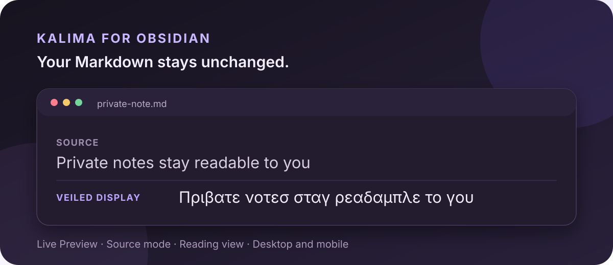

# Kalima


Kalima—styled **Kaλima**, with the Greek lambda at its center—is named after
the Greek word κάλυμμα (“cover” or “veil”). It is a shoulder-surfing filter for
webpages, Obsidian notes, and tmux panes. It
renders familiar Latin text through Greek, Cyrillic, Hebrew- and Arabic-script
glyphs, Katakana, Hiragana, or experimental Gregg Simplified-style outlines so
that content remains readable to you but becomes harder to parse at a glance.

It is a casual visual-obscurity layer, **not encryption**.

Kalima has no developer-operated service or telemetry. Its local data handling
is described in the [privacy policy](PRIVACY.md).



## What is implemented

- Greek, Cyrillic, Hebrew-glyph, Arabic-glyph, experimental Katakana and
  Hiragana packs, and an experimental Gregg Simplified connected-stroke pack
- Familiar, Fluent, and Dense profiles
- A configurable 0–50% cadence of fully visible word anchors
- Three rendering strategies:
  - **Visual overlay** keeps underlying page text available to copying, search,
    accessibility tools, page scripts, and inspection.
  - **Unicode text** produces actual script characters while active and restores
    captured page text when disabled.
  - **Connected strokes** keeps source words in the DOM and draws a Gregg SVG
    outline over each veiled word.
- Global, per-site, and per-tab activation
- Tab-lifetime overrides
- Five-second selected-text peek and press-and-hold localized peek
- Non-mutating input and chat-editor mirroring: a word veils when space commits it,
  while the word at the caret remains readable
- Page diagnostics that do not record page text or URLs
- Custom declarative JSON packs with validation and complexity limits
- Dynamic-page and open Shadow DOM handling
- Conservative exclusions for forms, editors, code, SVG, MathML, and arbitrary
  canvas, plus a dedicated Google Docs document-canvas adapter
- A shared-core Obsidian plugin for Markdown editor and Reading views
- An interactive tmux view and ANSI-safe command-line filter using the shared core

Hebrew and Arabic-script packs use a forced left-to-right visual overlay so
strong right-to-left Unicode characters do not reorder an English page. These
packs are glyph substitutions, not Hebrew or Arabic translation or
transliteration. Katakana and Hiragana use a local word-level pipeline:
established common words take conventional loanword spellings, while unknown
words pass through English sound rules and Japanese consonant–vowel shaping.
They remain experimental because spelling alone cannot resolve every English
pronunciation. Gregg is also experimental: its independently implemented
phonetic normalizer and stroke grammar produce Simplified-style approximations,
not dictionary-authoritative outlines. It does not bundle scans, a textbook
dictionary, or third-party shorthand artwork.

## Install in Chrome, Brave, Edge, or Arc

1. Open the browser's extension page:
   - Chrome/Arc: `chrome://extensions`
   - Brave: `brave://extensions`
   - Edge: `edge://extensions`
2. Enable **Developer mode**.
3. Choose **Load unpacked** and select the `browser-extension` directory.
4. Reload tabs that were already open.

If you change the extension source locally, run `npm run build:extension`
before reloading it in the browser. This regenerates the atomic content-script
bundles used by Chrome.

On a fresh install, Kalima automatically opens a focused one-minute local setup.
It previews scripts, chooses a reading strength and activation scope, and lets
you rehearse the peek key before the veil starts.
Existing users are not interrupted, and **Run setup again** remains available
in Settings. The veil otherwise starts enabled with the Greek Dense profile
using Unicode text.
Unicode is preferred whenever a pack supports it because it avoids the extra
DOM wrappers used by visual overlay mode, especially on long pages.

## Everyday controls

- Open the extension popup to select a script, strength, and renderer. Choose
  **Gregg Simplified · experimental** to try connected outlines. Changing an
  appearance control also turns Kalima on for the current tab.
- Adjust **Keep some words visible** to leave evenly distributed whole-word
  anchors. The default is 0%; 20% is a useful balanced starting point.
- Use **Always veil** or **Never veil** to save a site rule.
- Select some page text, then choose **Peek selected text** to reveal its block
  for five seconds.
- Hold **Alt/Option** to reveal only the block under the pointer while the key
  is down. If text is selected, its block is revealed instead.
- Press **Command/Ctrl–Shift–G** to toggle the current tab.
- **Veil completed words while typing** applies to ordinary text fields and
  supported contenteditable chat composers. It is on by default.

## Google Docs

Google Docs draws document pages onto canvas instead of exposing their text as
ordinary DOM text nodes. Kalima intercepts only the text-drawing calls for the
Docs document canvas and applies the active pack at paint time. The document
model, selection, search, copying, input events, and measured layout text remain
unchanged.

Load or reload the document after installing or updating Kalima. At startup,
the adapter briefly holds document-text draws until the extension's local
settings arrive, then replays them through the selected renderer. It restores
clear text after a bounded timeout rather than leaving a blank canvas. If that
timeout is reached, or if you change scripts or profiles after the page has
painted, the status pill says **RELOAD DOCS**. Reloading lets Docs repaint every
visible tile with one consistent setting. Unicode and visual-overlay selections
both use the canvas-safe glyph renderer; connected strokes remain clear because
the SVG stroke renderer cannot be inserted into the Docs canvas. This
integration is best-effort because it depends on Docs' private canvas surface.
Actions taken from the Kalima popup reload a Google Docs document automatically.

The settings page manages defaults, saved sites, custom packs, status-indicator
behavior, import/export, calibration, and complete reset. Alternate
sensitive-text scripts are limited to packs compatible with the selected
renderer so the setting never silently requests an impossible combination.

## Install in Obsidian

The Obsidian plugin shares the exact transformation and Gregg engines used by
the browser extension. It veils both the Markdown editor and Reading view
without changing the Markdown stored in the vault.

1. Run `npm ci` and `npm run package:obsidian` from this repository.
2. Create `.obsidian/plugins/kalima` inside a test vault.
3. Copy `main.js`, `manifest.json`, and `styles.css` from `dist/obsidian` into
   that directory.
4. Reload Obsidian and enable **Kalima** under **Community plugins**.

The plugin provides commands to toggle the veil, cycle scripts, and peek at
selected Reading-view text. In the editor, selected text and the word
containing the caret remain visible automatically. Its first release does not
veil file names, search results, backlinks, properties, Canvas, or UI created
by unrelated plugins.

On mobile, sync the complete `.obsidian/plugins/kalima` directory with the
vault, restart Obsidian, and enable Kalima under **Community plugins**. The
ribbon provides the mobile toggle because Obsidian does not expose its desktop
status bar on mobile.

## Install in tmux

Kalima for tmux opens the current pane through the shared Unicode transformer
in a temporary interactive window. The source pane continues running untouched,
while keyboard input is forwarded byte-for-byte to it. Press `Ctrl-G` twice to
close the Kalima view and return. Ordinary text, Enter, Escape, arrows, function
keys, control shortcuts, and application mouse events remain available to the
source application.

With [Tmux Plugin Manager](https://github.com/tmux-plugins/tpm), add Kalima to
`.tmux.conf` before the TPM initialization line:

```tmux
set -g @plugin 'mickadlr/kalima'
```

Then press prefix followed by <kbd>I</kbd>. For a direct checkout, add the root
loader using the absolute path to this repository:

```tmux
run-shell "/absolute/path/to/kalima/kalima.tmux"
```

Run `tmux source-file ~/.tmux.conf`, then press prefix followed by `K`. On first
use, a terminal setup wizard chooses the script, reading strength, clear-word
cadence, and refresh interval. It saves a dedicated local config and applies it
immediately. Press prefix followed by `Ctrl-k` to revisit settings; Kalima does
not replace that shortcut if it is already in use. Manual tmux options and the
standalone setup command are documented in
[`tmux-plugin/README.md`](tmux-plugin/README.md).

tmux has no DOM-like overlay layer. Kalima therefore captures the source pane's
visible screen into memory and displays a transformed copy instead of rewriting
the interactive PTY stream. It does not send source text to disk or the network.
The Unicode-capable Greek, Cyrillic, Katakana, and Hiragana packs are supported.
Arabic, Hebrew, and Gregg require visual renderers that terminals cannot safely
provide.

## Privacy boundary

Kalima is designed to slow down quick visual reading by another person.
Words intentionally left visible are completely readable to that person.
Common email, URL, currency, and long-number patterns are excluded from
clear-word selection, but this detection is best-effort and can miss sensitive
content.
It does not protect against:

- DOM inspection, accessibility APIs, page scripts, or other extensions
- Copying, screenshots, photography, or determined manual recovery
- Text inside images, video, arbitrary canvas, PDFs, browser chrome, or native
  interfaces (Google Docs document canvas has the dedicated best-effort adapter
  described above)
- A website that reconstructs or replaces its own content in unusual ways

The extension never changes password fields, typed form values, submitted data,
editable regions, or code blocks. Supported contenteditable chat composers use
the same non-mutating mirror as ordinary text fields: it makes the editor
glyphs transparent and positions an accessibility-hidden visual mirror
over them. The actual `value` remains unchanged for validation, copying,
selection, and submission. Password inputs are always excluded. It stores
settings, site origins, and tab state locally. It does not store page text,
transformed text, browsing history, or usage telemetry.

The Obsidian plugin does not call vault write APIs. Its Unicode and visual
renderers operate on CodeMirror decorations or disposable Reading-view HTML,
never on the Markdown source.

The tmux plugin captures only the source pane's visible screen and keeps it in
the local viewer process long enough to render the current frame. It never
writes captured text to a tmux buffer or a file. Keyboard bytes are relayed
locally to the selected source pane; Kalima never records them.

Visual overlay mode preserves source text but wraps eligible text nodes into
small spans. This is less semantically destructive than replacing text, but an
unusually fragile page can still react to the added elements. Use Unicode mode
or disable the extension for that site if necessary.

The Gregg connected-stroke renderer has the same source-text and wrapping
tradeoffs as visual overlay. Its output is intended for familiarity-driven
veiling and learning experiments, not transcription, teaching, or archival
shorthand.

## Custom pack format

Custom packs are JSON data, never executable code. The options page validates
them before installation. A minimal pack looks like:

```json
{
  "schemaVersion": 1,
  "id": "triangle-demo",
  "name": "Triangle demo",
  "maturity": "experimental",
  "renderers": ["overlay"],
  "defaultRenderer": "overlay",
  "defaultProfile": "familiar",
  "profiles": {
    "familiar": {
      "name": "Familiar",
      "mapping": {
        "a": "∆",
        "e": "⋿"
      }
    }
  }
}
```

Pack IDs cannot replace built-ins. Packs are limited to 200 KB, 10 profiles,
500 rules per mapping/token table, 16 characters per input token, and 32
characters per output.

## Safari

Safari web extensions are packaged through Xcode:

```bash
xcrun safari-web-extension-converter "/full/path/to/greek-veil/browser-extension"
```

Open the generated project, run the macOS app target, then enable Kalima in
Safari Settings → Extensions. Browser API differences may require additional
packaging validation before distribution.

## Optional native display font

`font-builder/build-kalima-font.py` creates a personal display font from a
local font that already contains Greek glyphs:

```bash
fontforge -script font-builder/build-kalima-font.py \
  "/path/to/source-font.ttf" \
  "$HOME/Desktop/Kalima-Regular.ttf"
```

Use only a source font whose license permits modification. The generated font
can be selected in native applications that expose font controls; macOS does
not support forcing it across every system interface.

## Development and verification

The project has no runtime dependencies.

```bash
npm run check
npm test
npm run package:release
```

Release packages are written under `dist`: a Chrome Web Store ZIP with its
manifest at the archive root, the three Obsidian release attachments, and a
standalone tmux `.tar.gz`. Chrome Web Store listing copy, privacy disclosures,
and artwork live in [`store/chrome`](store/chrome/README.md).

The browser smoke test replays the content renderer in branded Chrome and checks
eligible-text coverage, source restoration, open Shadow DOM, ChatGPT-, Lexical-,
and ProseMirror-style editors, IME composition, large chats, repeated SPA route
replacement, renderer switching, and bounded overlay tracking. To exercise the
complete extension context, point it at Chromium or Chrome for Testing because
modern branded Chrome builds do not accept command-line loading of unpacked
extensions:

```bash
npm run test:extension
GREEK_VEIL_CHROME_PATH="/path/to/chrome-for-testing" npm run test:extension
```

All fixtures are local and synthetic; diagnostics and failure output avoid real
page content. See `ARCHITECTURE.md` for implementation boundaries and
invariants. Before publishing, complete the
[release checklist](docs/RELEASE_CHECKLIST.md), including its physical Android
and iOS device matrix.

## Support and security

Use [GitHub Issues](../../issues) for reproducible bugs and feature requests.
Never attach private note text or browsing data; use synthetic text in
reproductions. Follow [SECURITY.md](SECURITY.md) for vulnerability reports.

## License

Kalima is proprietary source-available software, not open source. Unmodified
official releases may be used only for personal, non-commercial purposes.
Modification, compilation of the published source, redistribution, derivative
works, sublicensing, and commercial or organizational use require prior written
permission. See [LICENSE](LICENSE) for the controlling terms.
